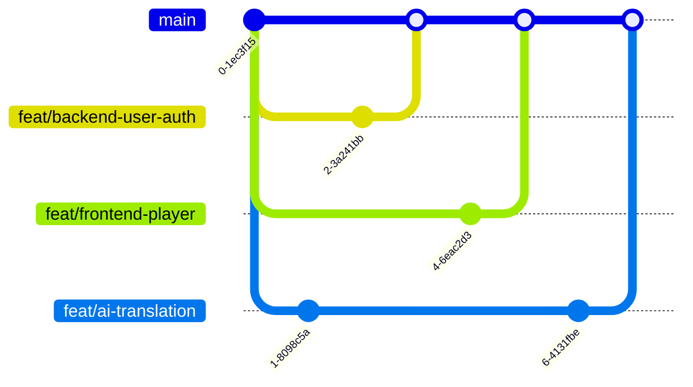

# AI shot — 多 Agent 协作指南

> 本文档供三台设备上的 Agent 阅读，描述前端、后端、AI 三个 Agent 如何通过 GitHub 协作。

## 角色分工

### Agent 1 — 后端 (Go)
- **目录**: `backend/`
- **职责**: API Gateway、User Service、Content Service、Video Service、Payment Service、数据库 Migration
- **依赖上游**: 无（独立开发）
- **交付下游**: Agent 2（API 接口）、Agent 3（AI 任务调度接口）
- **关键文档**: `project/docs/database.md` (数据模型)、`project/docs/architecture.md` (模块设计)

### Agent 2 — 前端 (Next.js + Flutter)
- **目录**: `frontend/web/` + `frontend/mobile/`
- **职责**: Web SSR、用户端 UI、管理后台、Flutter 移动端
- **依赖上游**: Agent 1 的 API（可先 Mock）
- **交付下游**: 无
- **关键文档**: `project/docs/openapi.yaml` (API 接口)、`project/docs/architecture.md` (BFF 层)

### Agent 3 — AI (Python)
- **目录**: `ai/`
- **职责**: ASR、翻译、配音、口型同步、推荐引擎、任务队列 Worker
- **依赖上游**: Agent 1 的视频上传接口、任务调度接口
- **交付下游**: Agent 1（AI 处理回调更新状态）
- **关键文档**: `project/docs/architecture.md` (AI 管线)、`project/docs/tasks.md` (排期)

## 协作协议

### 1. 共享知识库
所有 Agent **必须先读**以下文档再开始开发：
- `project/CLAUDE.md` — 项目全局信息
- `project/docs/architecture.md` — 架构设计
- `project/docs/database.md` — 数据模型
- `project/docs/openapi.yaml` — API 接口规范

### 2. 接口契约
- 前后端通过 **OpenAPI 规范** (`project/docs/openapi.yaml`) 约定接口
- API 变更必须同步更新 openapi.yaml 文件
- AI 管线通过 **消息队列** (RabbitMQ) 与后端解耦

### 3. Git 工作流


- 每个 Agent 从 main 分支独立开发
- 功能分支命名: `feat/<domain>-<feature>`
- 通过 Pull Request 合并，其他 Agent 做 Code Review

### 4. 目录隔离原则
- 各 Agent **只写自己的目录**（backend/ / frontend/ / ai/）
- 公共变更（如 openapi.yaml、database.md）需要其他 Agent 确认
- 根目录的 CLAUDE.md 和 README.md 任一 Agent 均可更新

### 5. 沟通方式
- **Commit Message**: 清晰描述改动内容，标注所属域
  - `feat(backend): add user registration API`
  - `feat(frontend): add video player component`
  - `feat(ai): integrate Whisper ASR pipeline`
- **文档**: 接口变更必须同步更新 `project/docs/`
- **GitHub Issues**: 跨 Agent 依赖用 Issue 跟踪

### 6. 数据库变更
- 数据库 Migration 由 **Agent 1（后端）** 统一管理
- 其他 Agent 需要新增字段时，向后端 Agent 提出需求
- Migration 脚本存放于 `backend/migrations/`

## 环境说明

### 本地开发
```bash
# Agent 1（后端）：启动依赖服务 + 后端
docker compose -f project/docker-compose.yml up -d postgres redis rabbitmq minio
cd backend && go run ./cmd/gateway

# Agent 2（前端）：启动前端
cd frontend/web && npm run dev

# Agent 3（AI）：启动 Worker
cd ai && python worker.py
```

### 完整环境
```bash
docker compose -f project/docker-compose.yml up -d
```

## PR 提交流程

```
1. git checkout -b feat/<domain>-<feature>
2. # 开发...
3. git add <自己目录的文件>
4. git commit -m "feat(<domain>): <描述>"
5. git push origin feat/<domain>-<feature>
6. # 在 GitHub 创建 PR，@其他 Agent 做 Review
7. # 合并后删除分支
```
